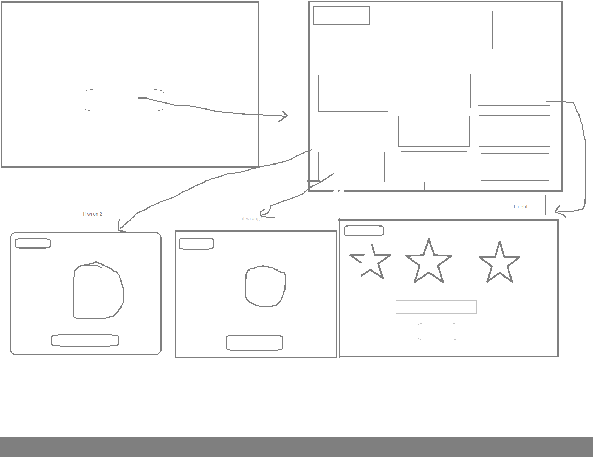
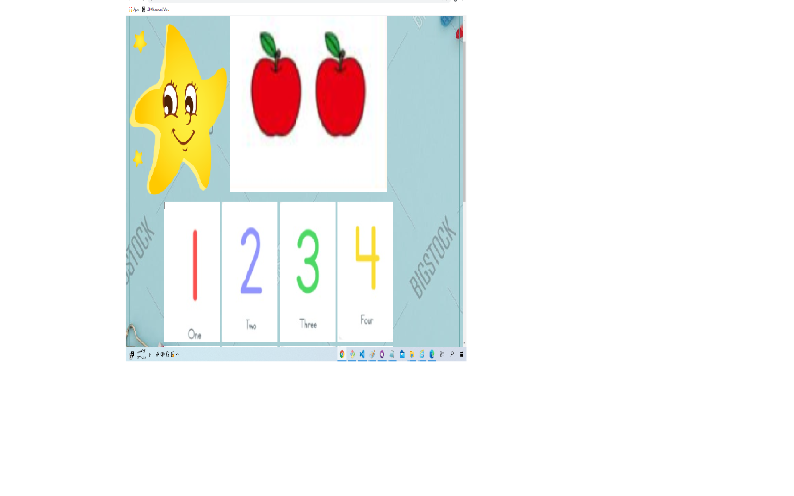
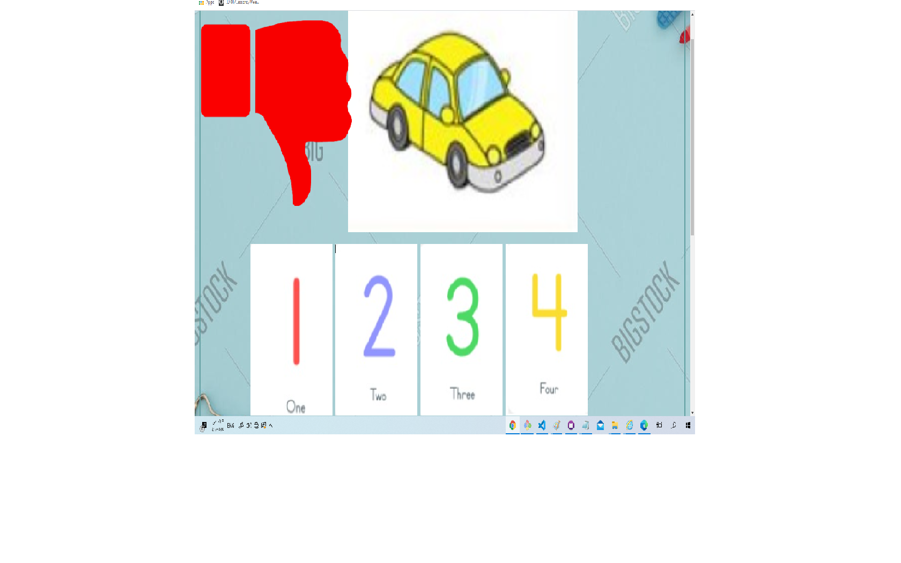

# project1
## A simple web game intract with children to maximise their skils in numbers.
### List technologies used
- Html
- Css
- JavaScript
- Jquery
- Git Bash
- Git Hub

### Link to wireframes and user stories.
- Wirframes
- 
- User Story 
  - The player start by Enter his name then click the button to go to the game
  - The game start by display the first picture which represent the number one the user should be choose from the list of number below it
  - The winner should be complete all picture by clicking the matching number for ache of them
  - After every correct answer the user get stimulated by star and voice , and the opposite with wrong answer
  - After finish all pictures, the game will print  his/her name with star.

### Document your planning and tell a story about your development process and problem-solving strategy.
The main plan is check the usre choice if it's related to the corrcte picفurs and intract with


### List unsolved problems which would be fixed in future iterations.
- We need to build a code witha good strategy without duplicate with reusable function and styles
-
### Describe how you solved for the winner
 - #
 - #

### Describe how some of your favorite functions work
- This function worked after clicking by the user
  first we have one id for all pictures  in first time has a class pic1
  if the user click 1 (#num) that mean it's true
  call right.play which turn the voice
  then call the show and hide frequently
   after that call addClass to Chang the class of id to move to next number and removeCalss to  remove the exist class.
```js
 $('#num1').click (function()
{
   if ($('#img').hasClass("pic1"))
   {
 
    right.play();
    $('.star').show();
    $('.star').hide('slow');
    $("#img").addClass("pic2");
    $('#img').removeClass("pic1");
   }
  else 
   {console.log('loser');
wrong.play();
$('.dislike').show();
$('.dislike').hide('slow');
```